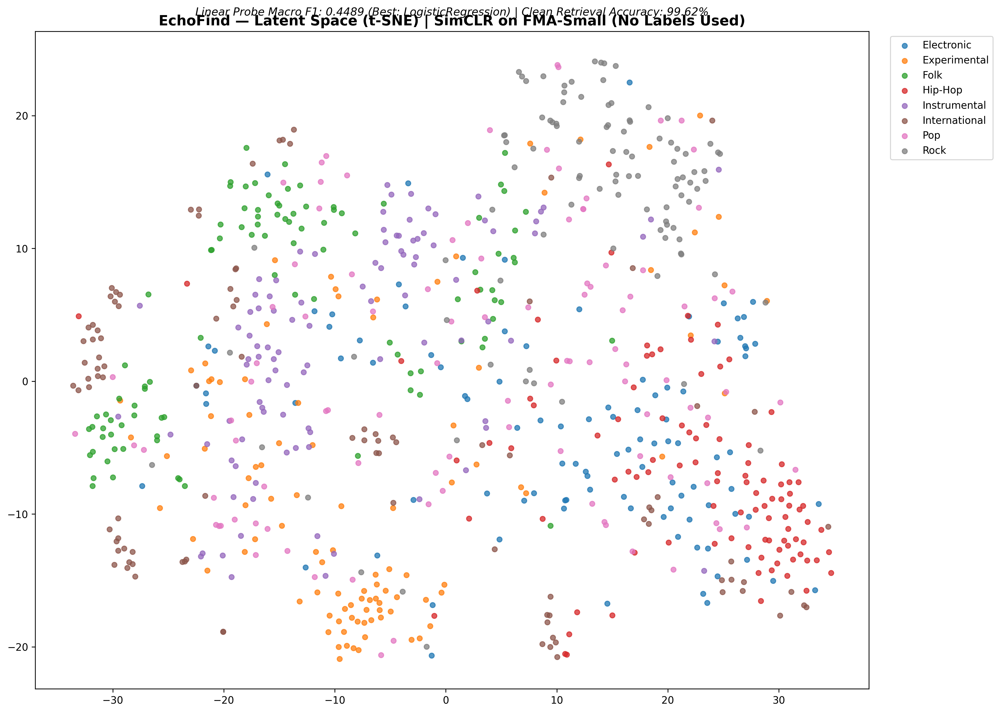

```markdown
# EchoFind: Self-Supervised Audio Representation & Retrieval Engine


A self-supervised audio representation system that learns to "hear" the structure
of music without any labels, then retrieves matching tracks from a noisy query —
similar to Shazam, but built entirely on semantic vector search.

---

## Results

| Metric | Value |
|--------|-------|
| Clean Retrieval Accuracy (FAISS) | **99.62%** |
| Linear Probe Macro F1 (20% labels) | **0.4489** |
| Labels used during pre-training | **0** |
| OOD Detection (non-music signals) | **3/3 correct** |
| Training dataset | FMA-Small (8,000 tracks, 8 genres) |

---

## Method

EchoFind uses **SimCLR** (Simple Framework for Contrastive Learning) to train an
audio encoder without any supervision. The model learns by solving a pretext task:
given two differently augmented views of the same audio clip, pull their embeddings
together in latent space while pushing all other clips apart.

### Architecture

```
Audio (.mp3)
    │
    ▼
Log-Mel Spectrogram (128 mels, hop=512, sr=22050)  →  shape: (1, 128, 1292)
    │
    ▼  Random 5s crop + Augmentation (SpecAugment + Gaussian noise)
    │
    ▼
ResNet-18 Encoder (1-channel input, no FC)          →  h ∈ ℝ⁵¹²
    │
    ▼  (training only)
MLP Projection Head (512 → 256 → 128)              →  z ∈ ℝ¹²⁸
    │
    ▼
NT-Xent Loss (τ = 0.1)
```

### Augmentation Pipeline
Three stochastic transforms applied independently to each view:
1. **SpecAugment frequency masking** — zeros up to 30 consecutive mel bands
2. **SpecAugment time masking** — zeros up to 50 consecutive time frames
3. **Gaussian noise injection** — additive noise σ = 0.01

### Retrieval
- All test tracks encoded → L2-normalized 512-dim vectors
- Indexed with `faiss.IndexFlatIP` (cosine similarity via inner product)
- Query: encode audio → cosine search → return nearest track ID

### Semantic Evaluation
- Encoder weights **frozen** after SSL pre-training
- `LogisticRegression` trained on 20% of labeled train embeddings
- Evaluated on full validation set (800 tracks)
- Proves the encoder learned linearly separable genre structure with zero label supervision

### OOD Detection
- Class-conditional Mahalanobis distance in embedding space
- Threshold at 95th percentile of training distribution
- Correctly flags white noise, 440Hz sine wave, and linear chirp as `"Unknown/Anomaly"`

---

## Latent Space Visualization

t-SNE projection of 800 validation embeddings colored by genre.
**No genre labels were used during training.**



Visible clustering of Hip-Hop, Rock, and Folk regions demonstrates that the
encoder learned semantically meaningful structure purely from audio self-supervision.

---

## Repository Structure

```
echofind/
├── src/
│   ├── __init__.py
│   ├── dataset.py       # FMADataset + augmentation pipeline
│   ├── model.py         # AudioEncoder, ProjectionHead, SimCLRModel
│   ├── losses.py        # NT-Xent contrastive loss
│   ├── retrieval.py     # FAISSRetriever: build_index, query, evaluate
│   └── ood.py           # MahalanobisOOD detector
├── precompute.py        # Spectrogram pre-computation
├── train.py             # Training script (argparse)
├── evaluate.py          # Retrieval accuracy evaluation
├── linear_probe.py      # Linear probe + t-SNE visualization
├── submission.py        # Inference API: get_embedding(), predict_track()
├── requirements.txt
└── README.md
```

---

## Pre-trained Weights

`encoder.pth` exceeds GitHub's 25MB limit and is hosted on Google Drive:

**[Download encoder.pth (44MB)](https://drive.google.com/file/d/1G7bn6ZHW7Zssh0EMcoR1hSYdA8YlTP-N/view?usp=sharing)**

Place it at `weights/encoder.pth` before running inference.

---

## Quick Start

```bash
git clone https://github.com/Shiva27653/echofind
cd echofind
pip install -r requirements.txt
```

### Pre-compute Spectrograms
```bash
python precompute.py \
    --audio_dir /path/to/fma_small \
    --specs_dir ./specs \
    --metadata_dir /path/to/fma_metadata
```

### Train
```bash
python train.py \
    --specs_dir ./specs \
    --metadata_dir /path/to/fma_metadata \
    --weights_dir ./weights \
    --epochs 50 --batch_size 256 --lr 3e-4
```

### Evaluate
```bash
python evaluate.py \
    --specs_dir ./specs \
    --weights_dir ./weights \
    --metadata_dir /path/to/fma_metadata
```

### Inference
```python
from submission import get_embedding, predict_track
import numpy as np

emb = get_embedding("query.mp3")           # returns (512,) numpy array
track_id = predict_track("query.mp3", database)  # database: {track_id: embedding}
```

---

## Dataset

[FMA: A Dataset For Music Analysis](https://github.com/mdeff/fma) — FMA-Small subset
- 8,000 tracks × 30 seconds, 8 genres, perfectly balanced (1,000 per genre)
- Genre labels used **only** for linear probe evaluation, never during SSL pre-training

---

## Training Details

| Hyperparameter | Value |
|---|---|
| Backbone | ResNet-18 (1-channel, from scratch) |
| Embedding dim | 512 |
| Projection dim | 128 |
| Temperature τ | 0.1 |
| Optimizer | AdamW (lr=3e-4, wd=1e-4) |
| Scheduler | CosineAnnealingLR (T_max=50) |
| Batch size | 256 |
| Epochs | 50 |
| Precision | Mixed (torch.cuda.amp) |
| Hardware | 2× NVIDIA T4 (16GB each) |

---

## References

- Chen et al. (2020). [A Simple Framework for Contrastive Learning of Visual Representations](https://arxiv.org/abs/2002.05709). ICML.
- Park et al. (2019). [SpecAugment: A Simple Data Augmentation Method for ASR](https://arxiv.org/abs/1904.08779). Interspeech.
- Defferrard et al. (2017). [FMA: A Dataset For Music Analysis](https://arxiv.org/abs/1612.01840). ISMIR.
- Lee et al. (2018). [A Simple Unified Framework for Detecting Out-of-Distribution Samples](https://arxiv.org/abs/1807.03888). NeurIPS.

---

## Author

**Shiva Sukumar**
B.Tech Electronics & Telecommunication, DJSCE Mumbai
Research Intern, IIT Mandi | ML Intern, Sentient Biotech
[GitHub](https://github.com/Shiva27653) · [LinkedIn](https://www.linkedin.com/in/shiva-sukumar-93b06b31a/)
```

***
